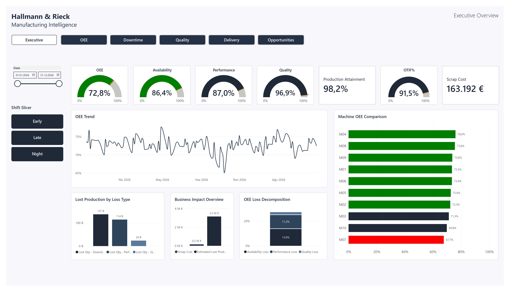

# Hallmann & Rieck — Manufacturing Intelligence

**A Power BI portfolio project connecting manufacturing performance, reliability, quality and delivery outcomes.**

## Overview

This project demonstrates how operational data can be transformed into an interactive manufacturing performance reporting solution for a fictional CNC machining company.

The report combines plant-level KPIs with machine-level and machine–product investigations. Its objective is to make performance gaps visible and provide measurable evidence for further investigation—not to automate management decisions.

> **Synthetic portfolio project:** Hallmann & Rieck is fictional. All company names, operational records and business figures are synthetic and created for demonstration purposes. This is not a real customer engagement.

## Report pages

1. **[Executive Overview](preview/01-executive-overview.jpg)** — Plant-level performance, OEE components, machine comparison and estimated business impact.
2. **[OEE & Machine Performance](preview/02-oee-machine-performance.jpg)** — OEE trends, machine comparisons, shift analysis and machine–product views.
3. **[Downtime & Reliability](preview/03-downtime-reliability.jpg)** — Downtime Pareto, MTBF, MTTR, machine downtime and maintenance cost.
4. **[Quality](preview/04-quality.jpg)** — Defect Pareto, scrap and rework performance, quality by shift and machine–product scrap heatmap.
5. **[Delivery & Business Impact](preview/05-delivery-business-impact.jpg)** — OTIF, On-Time, In-Full, customer performance, estimated losses and production attainment.
6. **[Machine Investigation](preview/06-machine-investigation.jpg)** — Machine-specific drill-through analysis across performance, downtime, failure codes, maintenance history and product impact.
7. **[Quality Investigation](preview/07-quality-investigation.jpg)** — Machine–product drill-through investigation of defect distribution, scrap, rework and quality trends.
8. **[Improvement Opportunities](preview/08-improvement-opportunities.jpg)** — An evidence-based worklist for further investigation, without an automated priority score or claiming which action management should take first.

## Analytical approach

- OEE calculated as Availability × Performance × Quality, with measures designed for appropriate aggregation grain.
- DAX measures for operational KPIs and estimated business impact.
- KPI thresholds maintained in a configuration table.
- Dimensional data model with interactive slicers and native drill-through navigation.
- Downtime, quality, delivery and business-impact analysis presented in a consistent reporting experience.
- Improvement opportunities framed as measurable evidence—not automated recommendations or composite rankings.

## Tools & techniques

- Microsoft Power BI Desktop
- DAX
- Dimensional data modelling
- KPI design and conditional formatting
- Drill-through and interactive reporting
- Lean Manufacturing and Operational Excellence concepts

## How to view

1. Download the `.pbix` file from this repository.
2. Open it with Microsoft Power BI Desktop.
3. Navigate through the eight report pages and test the available filters and drill-through views.

The PBIX contains a saved data snapshot for viewing. Refreshing the data may require the original source files or a compatible source path; those raw source files are not included in this public portfolio repository.

## Project scope and limitations

This is a portfolio demonstration, not a real customer engagement. Figures and KPI thresholds are illustrative; they are not industry benchmarks and must be validated against a real plant's data before operational use. Some business-impact values are estimates based on the synthetic dataset's defined assumptions.

## Author

Developed as a portfolio project at the intersection of manufacturing operations, Lean, Operational Excellence and Business Intelligence.
